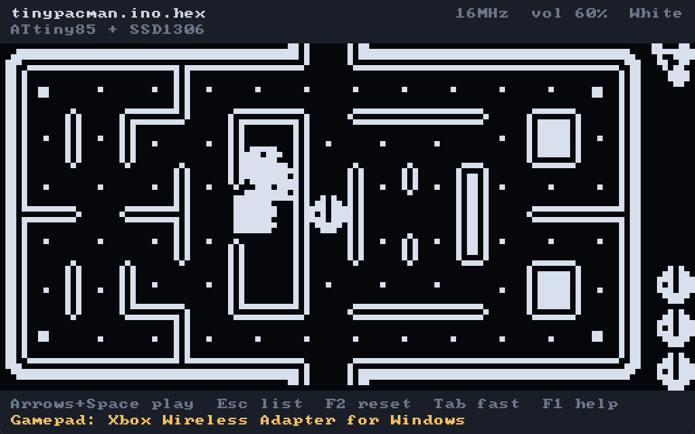

# TinyJoypad Emulator
   



An emulator for the [TinyJoypad](https://www.tinyjoypad.com) handheld — an
ATtiny85 driving a 128x64 SSD1306 OLED — written in C with SDL3.

It is an emulator, not a re-implementation: [simavr](https://github.com/buserror/simavr)
executes the real ATtiny85 machine code straight out of a `.hex` file, and this
project models the hardware around the chip. Nothing knows anything about any
particular game.

Do note this project was made with the help of claude.ai (Anthropic)

## Not an official TinyJoypad project

This emulator is an independent, unofficial piece of software. It runs TinyJoypad
games, but it is **not affiliated with, endorsed by, or supported by** Électro
L.I.B (Daniel C.), who created the TinyJoypad and wrote many of the games for it,
nor by any of the other authors whose games it happens to run.

Nothing here is their work and nothing here has their blessing. Please do not
report emulator problems to them, and do not take anything the emulator does as
a statement about how the real hardware behaves — where the two disagree, the
hardware is right and this is a bug worth reporting *here*.

The TinyJoypad itself — schematics, hardware, and the original games — is at
[tinyjoypad.com](https://www.tinyjoypad.com). Every game remains the property of
its own author under its own licence, which for most of them is GPLv3. No games
are distributed with this emulator.

## What is emulated

The TinyJoypad rev2 schematic, pin for pin:

```
                       3V3
                        |
   PB5 / ADC0  <--- 22k-+--[ 88k: left ][ 33k: right ]--- GND
   PB3 / ADC3  <--- 22k-+--[ 33k: up   ][ 88k: down  ]--- GND
   PB1         <--- 10k pull-up, action switch to GND
   PB4         ---> piezo speaker
   PB0         <--> SSD1306 SDA
   PB2         ---> SSD1306 SCL
```

* **ATtiny85** — simavr's core, clocked at 16 MHz (switchable to 8 MHz).
* **SSD1306** — GDDRAM, all three addressing modes, segment remap, COM scan
  direction, start line, multiplex ratio, display offset and inversion. The
  contrast register is decoded and reported in the hardware view, but is not
  applied to brightness: on the modules these games run on it makes very little
  perceptual difference, and the collection ships `0x00`, `0x3f`, `0x7f` and
  `0xcf` interchangeably while all of them look white on real hardware.
* **Panel persistence** — the panel is modelled as a surface with rise and fall
  time constants rather than a buffer sampled once a frame. TinyJoypad games
  draw straight into the display one page at a time with no back buffer, and
  several flicker sprites on alternate passes to fake extra shades; sampling
  that at 60 Hz gives tearing and strobing the real device does not have. The
  emulator integrates the panel many times per displayed frame instead. F7
  turns it off.
* **The I2C bus** — recovered from the PB0/PB2 pin levels the way a logic
  analyser would, because these games bit-bang it by hand. The emulator drives
  the ACK bit, so firmware that checks for a NAK behaves correctly.
* **The USI** — some games (Tiny Invaders v4.2, the older TinyDungeon builds)
  use the ATtiny85's USI peripheral in two-wire mode instead of bit-banging.
  Those are handled too; see the note in `src/tj_board.c`.
* **The joystick ladders** — solved as actual resistor dividers, so pressing
  two opposing directions at once produces the same out-of-range reading the
  hardware would, rather than a direction that is impossible on a real unit.
* **The speaker** — PB4 is integrated exactly between audio samples, so the
  square wave is anti-aliased instead of point-sampled, and DC-blocked the way
  the AC-coupled piezo is.
* **The PLL** — simavr's tinyx5 core has no PLL, but the part runs from it at
  16 MHz and firmware that enables it spins on `PLOCK`. Mirrored so that wait
  terminates, as it does on silicon.

Audio is the master clock: each frame the CPU is run for exactly as many cycles
as the audio device still needs samples for, which keeps emulated time locked to
real time and the speaker free of gaps.

## Building

Both dependencies are vendored as submodules; there is nothing else to install.
No `avr-gcc` is needed, and libelf is not used.

```sh
git clone --recurse-submodules <this repo>
cd Tinyjoypad_Emulator
cmake -S . -B build -DCMAKE_BUILD_TYPE=Release
cmake --build build
```

If you already cloned without `--recurse-submodules`:

```sh
git submodule update --init --recursive
```

To link an already-installed SDL3 instead of building the vendored one, add
`-DUSE_VENDORED_SDL=OFF`.

Built and tested with GCC 16 (MSYS2 mingw-w64) and CMake 4.4 on Windows 11.
The code is written to be portable — SDL3 and simavr both are, the only
platform-specific paths are the drive list in the browser and how `--help` and
argument errors are reported (see below) — but it has not yet been built on
Linux or macOS, so expect to shake out a wrinkle or two there.

Usage and error messages go to the terminal and, when there is no terminal to
print to, to an `SDL_ShowSimpleMessageBox` dialog. On Windows that is always,
because this is a windowed binary with no console; on Linux and macOS the
dialog appears only when the program was started from a file manager or the
dock rather than a shell.

## Running

```sh
./build/Tinyjoypad_Emulator                  # opens the .hex browser
./build/Tinyjoypad_Emulator path/to/game.hex # boots straight into a game
```

You can also drag a `.hex` file onto the window.

### Command line

```
Usage: Tinyjoypad_Emulator [options] [game.hex]

  -f, --fullscreen   Start fullscreen
  -w, --windowed     Start windowed, ignoring the saved setting
  -s, --size WxH     Window size in pixels, e.g. 1280x800 (minimum 256x160)
      --scale N      Window size as N times the 512x320 logical size (1-16)
  -r, --rotate       Start with the screen flipped 180 degrees
      --no-rotate    Start unflipped, ignoring the saved setting
  -h, --help         Show this message
```

`--size` and `--scale` both accept `--opt value` or `--opt=value`, and the last
one given wins. Because the whole interface is drawn at a fixed 512x320 and
letterboxed, `--scale` is usually the one you want: `--scale 3` gives a 1536x960
window with the OLED at exactly 12 real pixels per emulated one.

Size, fullscreen and rotation given on the command line apply to that run only —
they do not overwrite the settings saved from the emulator itself, so
`--fullscreen` for one session will not leave you fullscreen the next time.

```sh
./build/Tinyjoypad_Emulator --fullscreen "more games/Tiny Pacman/tinypacman/tinypacman.ino.hex"
./build/Tinyjoypad_Emulator --scale 3
./build/Tinyjoypad_Emulator --size 1280x800 --windowed
./build/Tinyjoypad_Emulator --rotate "more games/Tiny Mania/TinyMania/TinyMania.ino.hex"
```

### Controls

| | |
|---|---|
| Move | Arrow keys or WASD, gamepad d-pad or left stick |
| Action button | Space, Z, X, Enter, Ctrl — or gamepad **A** / **B** |
| Back to the list | `Esc`, or gamepad **Start** (`Esc` again resumes) |
| Flip screen 180° | `F8`, or gamepad **Y** |
| Pause / fast-forward | `P` / hold `Tab` |
| Reset | `F2` |
| Clock 8 / 16 MHz | `F5` |
| Panel colour | `F6` |
| Panel persistence | `F7` |
| Screenshot (native 128x64) | `F10` |
| Hardware view | `F12` |
| Fullscreen | `Alt`+`Enter` or `F11` |
| Volume | `+` / `-` |
| Help | `F1` |

Gamepads are hot-pluggable and up to eight can be used at once; they also drive
the browser (d-pad to move, **A** to open, **B** to go up a folder).

The TinyJoypad has exactly one action switch, so only **A** and **B** fire.
**X**, the shoulders and **Select** are left unbound on purpose — on a
one-button console they are worth far more as emulator controls than as extra
ways to press the same switch.

### Which way up?

Not every game is drawn for the same orientation. Some builds assume the board
mounted the other way round and come out upside down — *TinyMania* is one. `F8`
(or **Y** on a gamepad) flips the panel 180°, which is a horizontal plus a
vertical flip, and the setting is remembered. Screenshots come out the same way
up as the screen. When it is on, the header shows `180`.

In fullscreen a running game gets the whole display: the title and hint bars are
windowed-mode furniture and are dropped, leaving only the panel, letterboxed to
its own 2:1 shape rather than stretched. Messages such as *Clock: 8 MHz* still
appear briefly along the bottom, then disappear again. The browser keeps its
chrome in fullscreen, since it needs it.

### Saved games

Several games keep high scores or progress in the ATtiny85's 512 bytes of
EEPROM, which survives a power cycle on real hardware. The emulator gives them
the same: the EEPROM is mirrored to a file named after the game, so
`tiny-tris_v3.ino.hex` saves to `tiny-tris_v3.ino.eeprom` beside it.

This is entirely automatic — read back when the game starts, written out as you
play. There is no save key and nothing to remember. Writes are coalesced and
land about a second after the game stops touching its EEPROM, so a save is
safe even if the emulator is killed rather than closed.

A file is only created once a game actually writes to its EEPROM, so browsing
through a folder of games does not scatter save files around. Reset (`F2`)
keeps the EEPROM, just as resetting the real hardware does.

The file is a raw dump, one byte per EEPROM byte — not Intel HEX, so it is not
directly flashable with avrdude. A short file is padded with `0xff`, which is
what erased EEPROM reads as.

Games that use it include Tiny Tris, Tiny Invaders v4.2, obono's Test Tool and
several of the attiny-arcade titles; the list is not exhaustive, since a game
may only write its EEPROM on game over.

### The .hex browser

TinyJoypad games tend to live scattered deep inside source trees, so as well as
ordinary folder navigation the browser has a **recursive mode** (`F4`, or
`Ctrl+R`) that collects every `.hex` beneath the current folder into one flat
list, labelled by relative path. Point it at a checkout of a game collection and
it becomes a playable menu. Type any text to filter the list; `F3` opens the
system file dialog instead.

Window size, last folder, volume, clock, colour and the rest are remembered
between runs.

### Clock speed

Which clock a game was built for is not recorded in a `.hex` file. TinyJoypad
rev2 runs the ATtiny85 at 16 MHz, which is the default and correct for
essentially everything. If a game runs at double or half speed, `F5` switches to
8 MHz and restarts it.

### Files that are not TinyJoypad games

Collections often mix in builds for other boards. Anything too large for the
ATtiny85's 8 KB of flash is rejected with an explanation rather than crashing —
an Arduboy build of the same game, for instance, is around 18 KB.

## Where to get games

No games ship with this emulator. A game is a single `.hex` file — the compiled
ATtiny85 firmware — and you either download one or build it yourself.

### Download

| Where | What is there |
|---|---|
| [tinyjoypad.com/tinyjoypad_attiny85](https://www.tinyjoypad.com/tinyjoypad_attiny85) | The main catalogue. Daniel C.'s own games — Tiny Pacman, Tiny Invaders, Tiny Arkanoid, Tiny Bert, Tiny Pinball and many more — plus contributed titles, each with source, a `.hex` and a video. Note that the page also lists "other projects" that are *not* TinyJoypad-compatible. |
| [github.com/Lorandil](https://github.com/Lorandil) | [TinyDungeon](https://github.com/Lorandil/TinyDungeon) (a full dungeon crawler), [TinyMinez](https://github.com/Lorandil/TinyMinez) (Minesweeper), and [Tiny-invaders-v4.2](https://github.com/Lorandil/Tiny-invaders-v4.2) (a reworked Tiny Invaders v3.1). Also worth a look if you want to write your own: [OLED_sprites](https://github.com/Lorandil/OLED_sprites), [Cross-Development-for-TinyJoypad](https://github.com/Lorandil/Cross-Development-for-TinyJoypad) and the [ATTiny85 optimization guide](https://github.com/Lorandil/ATTiny85-optimization-guide). |
| [obono/TinyJoypadWorks](https://github.com/obono/TinyJoypadWorks/) | Four titles: **Test Tool** (OBN-T00), **Hollow Seeker** (OBN-T01), **Number Place** (OBN-T02) and **2048** (OBN-T03). |
| [tscha70/TinyLanderV1.0](https://github.com/tscha70/TinyLanderV1.0) | **Tiny Lander**, a Lunar Lander for the ATtiny85 at 16 MHz. |
| [note.com/kondolab](https://note.com/kondolab) | Kondo Lab's Japanese-language build logs for games written with AI assistance, including [**TinY Fi**](https://note.com/kondolab/n/n2c96413eaa23), a fighting game with six stages and boss fights, and [**TinyRoG**](https://note.com/kondolab/n/n1806e4234495), a 30-floor roguelike with procedurally generated mazes. See also the [project overview](https://note.com/kondolab/n/ndc93ac31e555) and the [roguelike development diary](https://note.com/kondolab/n/ndb6bf9c5b9d6). |

### Build your own

Most of these projects publish their source as an Arduino sketch, so you can
compile your own `.hex` — handy for tweaking a game, and the only option when a
project ships source but no binary.

The stock Arduino IDE cannot target an ATtiny85, so install
[ATTinyCore](https://github.com/SpenceKonde/ATTinyCore) by adding this to
*File → Preferences → Additional Boards Manager URLs*:

```
http://drazzy.com/package_drazzy.com_index.json
```

Then set, under **Tools**:

| | |
|---|---|
| Board | ATTinyCore → **ATtiny25/45/85 (No bootloader)** |
| Chip | **ATtiny85** |
| Clock Source | **16 MHz (PLL)** — internal, no crystal |
| LTO | Enabled — you need it to fit in 8 KB |
| millis()/micros() | Enabled, unless the game says otherwise |

**Sketch → Export Compiled Binary** (Ctrl+Alt+S) then writes the `.hex` next to
the sketch, and that file loads straight into this emulator. That is where the
`*.ino.hex` files you find in these repositories come from.

If you also want to flash a real TinyJoypad, program it with an Arduino as ISP
and **burn the bootloader once** first — on a "No bootloader" board that only
writes the fuses, but without it the chip stays on its factory 1 MHz and every
game crawls. Upload with **Sketch → Upload Using Programmer**, not the normal
Upload button.

Do not select *Arduino Uno* to build for a TinyJoypad. The ATtiny85 is a
different core with no hardware multiplier and a different register map, and
several of these sketches deliberately compile a completely different
Uno-with-an-OLED variant when they see an ATmega — useful for debugging on an
Uno, but not a TinyJoypad binary.

## Layout

| | |
|---|---|
| `src/tj_board.c` | the ATtiny85 and everything wired to its pins |
| `src/tj_ssd1306.c` | the display controller and the panel model |
| `src/tj_i2c.c` | bit-banged I2C recovered from pin levels |
| `src/tj_browser.c` | the `.hex` browser |
| `src/tj_ui.c`, `src/tj_config.c` | drawing helpers, saved settings |
| `src/main.c` | window, audio, input, main loop |
| `simavr_config/` | the two headers simavr normally generates at build time |

## Licence

simavr and SDL3 keep their own licences (GPLv3 and Zlib respectively). Note that
linking simavr makes the resulting binary GPLv3 so this whole project is GPLv3.
